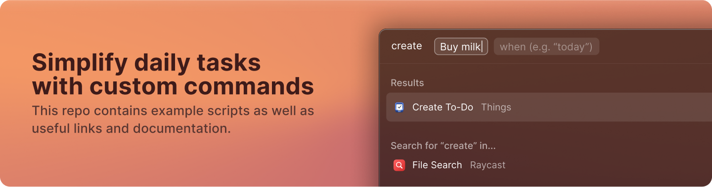

<div align="center">
  

  <div align="center">
    <a href="https://github.com/raycast/script-commands/tree/master/commands">
        
    </a>
    <a href="https://twitter.com/raycastapp">
      
    </a>
  </div>

<br>

  <h1>Raycast Script Commands</h1>

</div>

[Raycast](https://raycast.com/) lets you control your tools with a few keystrokes and installing script commands makes it possible to execute commands from anywhere on your desktop. They are a great way to speed up every-day tasks such as converting data, opening bookmarks or triggering dev workflows. This repository contains some example scripts as well as links to our community commands and documentation to write your own ones.

**✨ Looking to build richer extensions?** Check out the Extensions API [here](https://github.com/raycast/extensions).

🚨 For anything that is not related to script commands, please [send us an email](mailto:feedback@raycast.com), use the feedback command within Raycast, or join the [Slack community](https://www.raycast.com/community).

<br>
<br>



<br>
<br>

## Install Script Commands from this repository

To install new commands, follow these steps:

1. Choose a script from the [community repo](https://github.com/raycast/script-commands/tree/master/commands#apps) and save it into a new directory.
   
   Scripts containing the word `.template.` in the filename require some values to be set (check [the troubleshooting section](#troubleshooting-and-faqs) for more information).
   
   Alternatively, instead of creating a new directory you can reuse the repo's [`_enable-commands` folder](https://github.com/raycast/script-commands/tree/master/_enabled-commands).
3. Open the Extensions tab in the Raycast preferences
4. Click the plus button
5. Click `Add Script Directory`
6. Select directories containing your Script Commands

**💡 Hint:** We recommend that you don't directly load the community script directories into Raycast to avoid potential restructuring and new script commands suddenly appearing in Raycast.


## Create your own Script Commands

To write your own custom Script Commands, go over the following steps:

1. Use the `Create Script Command` functionality in Raycast
2. Write and edit your script using your favourite code editor
3. Run your Script Command from the Raycast root search

**💡 Hint:** If you choose to write your script in `Bash`, we highly recommend using the [Shellcheck](https://marketplace.visualstudio.com/items?itemName=timonwong.shellcheck) linter as this will ensure smooth running of your script. All  scripts uploaded to GitHub will need to have been run through ShellCheck.


### Metadata

These parameters are available for you to customize your Script Command in Raycast. For practical examples of how these should be used, as well as best practices and supported languages, please browse our templates and community-built scripts.

| Name                 | Description                                                                                                                                                                                                                                                                          | Required | App Version         |
|----------------------|--------------------------------------------------------------------------------------------------------------------------------------------------------------------------------------------------------------------------------------------------------------------------------------|----------|---------------------|
|schemaVersion        | Schema version to prepare for future changes in the API. Currently there is only version 1 available.                                                                                                                                                                                | Yes      | 0.29+               |
| title                | Display name of the Script Command that is shown as title in the root search.                                                                                                                                                                                                        | Yes      | 0.29+               |
| mode                 | Specifies how the script is executed and how the output is presented. [Details of the options for this parameter can be viewed here](https://github.com/raycast/script-commands/blob/master/documentation/OUTPUTMODES.md) | Yes      | 0.29+               |
| packageName          | Display name of the package that is shown as subtitle in the root search. When not provided, the name will be inferred from the script directory name.                                                                                                                               | No       | 0.29+               |
| icon                 | Icon that is displayed in the root search. Can be an emoji, a file path (relative or full) or a remote URL (only https). Supported formats for images are PNG and JPEG. Please make sure to use small icons, recommended size - 64px.                                                | No       | 0.29+               |
| iconDark             | Same as `icon`, but for dark theme. If not specified, then `icon` will be used in both themes.                                                                                                                             | No       | 1.3.0+              |
| currentDirectoryPath | Path from which the script is executed. Default is the path of the script.                                                                                                                                                                                                           | No       | 0.29+               |
| needsConfirmation    | Specify `true` if you would like to show confirmation alert dialog before running the script. Can be helpful with destructive scripts like "Quit All Apps" or "Empty Trash". Default value is `false`.                                                                               | No       | 0.30+               |
| refreshTime          | Specify a refresh interval for inline mode scripts in seconds, minutes, hours or days. Examples: 10s, 1m, 12h, 1d. Note that the actual times can vary depending on how the OS prioritises scheduled work. The minimum refresh interval is 10 seconds. If you have more than 10 inline commands, only the first 10 will be refreshed automatically; the rest have to be manually refreshed by navigating to them and pressing `return`.| No       | 0.31+ |
| argument[1...3]      | [Custom arguments, see Passing Arguments page](https://github.com/raycast/script-commands/blob/master/documentation/ARGUMENTS.md) for detail of how to use this field | No | 1.2.0+ |
| author               | Define an author name to be part of the script commands documentation | No | |
| authorURL            | Author social media, website, email or anything to help the users to get in touch | No | |
| description          | A brief description about the script command to be presented in the documentation | No | |

### Output Mode

You can use the standard output to present messages in Raycast. Depending on the `mode`, the standard output of your scripts is differently presented.`fullOutput` and `inline` modes support ANSI Escape codes allowing to color generated output by changing its background and foreground color. [You can view the different output mode options as well as their various forms and color options here.](https://github.com/raycast/script-commands/blob/master/documentation/OUTPUTMODES.md)


### Error Handling

If the script exits with a status code not equal to 0, Raycast interprets it as failed and shows a toast that the script failed to run. If this script has inline or compact mode, the last line of the output will be used as an error message. Consider this example for a bash script:
```bash
if ! [[ $value =~ $regex ]] ; then
  echo "Invalid value provided"
  exit 1
else
  ...
```

## Troubleshooting and FAQs
<details>
  <summary>Why isn't my script appearing in Raycast?</summary>

* Ensure the filename doesn't contain `.template.` string
* Check that all required metadata parameters are provided. See the table above which parameters are required.
* Ensure you use either `#` or `//` comments for metadata parameters
* If nothing helps, try to go step by step from a [template](https://github.com/raycast/script-commands/tree/master/templates) Script Command or use one of the examples in this repo.
</details>

<details>
  <summary>Why isn't my Shell script  working?</summary>

* Ensure the filename doesn't contain `.template.` string
* Run your code through [ShellCheck](https://www.shellcheck.net/) to check for syntax errors or unexpected characters
</details>

<details>
  <summary>Can I build in a non-login shell?</summary>

**We only allow Script Commands that run in a non-login shell in this repository as agreed on in our [contribution guidelines](https://github.com/raycast/script-commands/blob/master/CONTRIBUTING.md), due to any dependencies.**
However, if you need to run your local script as login-shell, you can specify an argument after shebang, e.g. `#!/bin/bash -l` for bash. We also append `/usr/local/bin` to `$PATH` variable so you can use your local shell commands without any additional steps. If this is not enough, you can always extend `$PATH` by adding `export PATH='/some/extra/path:$PATH'` at the top of your script.
</details>

## Community

We're always looking for new Script Commands or other ways to improve Raycast. If you have anything cool to show, please send us a pull request. If we screwed something up, please report a bug. Join our [Slack community](https://www.raycast.com/community) to brainstorm ideas with like-minded folks.
