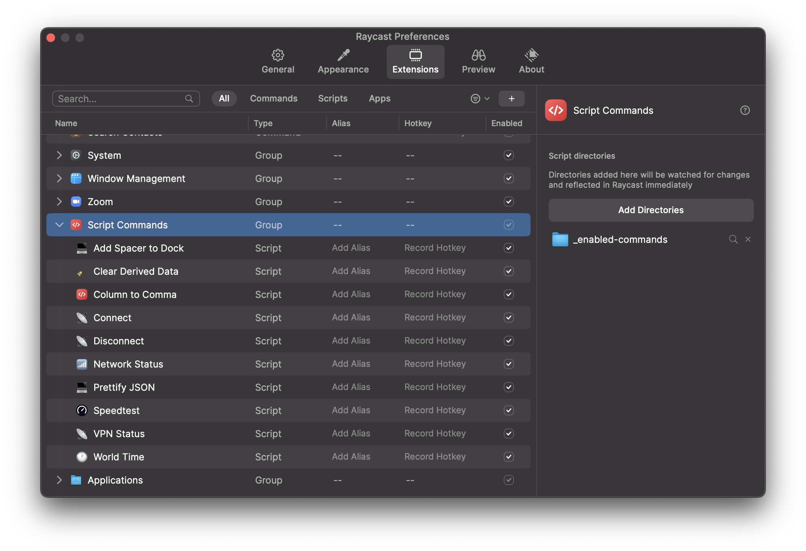
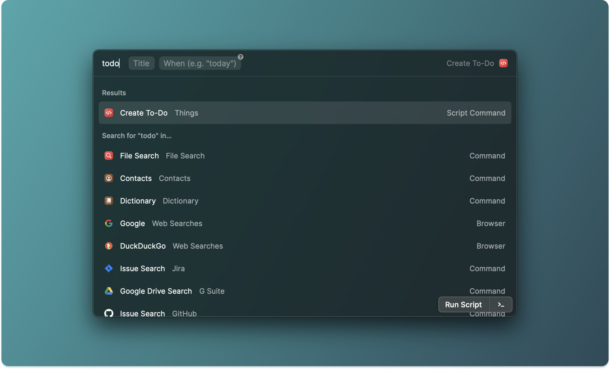

<div align="center">
  <a href="https://raycast.com">
    
  </a>

  <br/>
  <br/>
  <h1>Raycast Script Commands</h1>

  <!-- Images -->
  <a href="https://github.com/raycast/script-commands/graphs/contributors">
    
  </a>
  <a href="https://twitter.com/raycastapp">
    
  </a>
  <a href="https://github.com/raycast/script-commands/stargazers">
    
  </a>

  <br/>
  <br/>
  <i>Script Commands lets you tailor Raycast to your needs. <br/> Think of them as little productivity boosts throughout your day.</i>
</div>

<hr>

# Raycast Script Commands

[Raycast](https://raycast.com) lets you control your tools with a few keystrokes and Script Commands makes it possible to execute scripts from anywhere on your desktop. They are a great way to speed up every-day tasks such as converting data, opening bookmarks or triggering dev workflows.


This repository contains sample commands, community commands, and documentation to write your own ones.

- [Raycast Script Commands](#raycast-script-commands)
  - [Awesome Script Commands](#awesome-script-commands)
  - [Install Script Commands](#install-script-commands)
  - [How to use this repository](#how-to-use-this-repository)
  - [Write Script Commands](#write-script-commands)
    - [API](#api)
    - [Standard Output](#standard-output)
    - [Passing Arguments](#passing-arguments)
    - [Error Handling](#error-handling)
    - [Login Shell and `$PATH`](#login-shell-and-path)
  - [Troubleshooting](#troubleshooting)
  - [Community](#community)

## Awesome Script Commands

You can find a lot of [useful script commands built by our community](commands/) here.

Want to contribute? What a brilliant idea, please see this [contribution guide](CONTRIBUTING.md), it will help you with getting started.

## Install Script Commands

To install new commands, follow these steps:

1. Open the Extensions tab in the Raycast preferences
2. Select the Script Commands extension
3. Click `Add More Directories`
4. Select the Script Command that you want to install



To get started, download one of the sample commands in this repository or [write a custom script](#write-script-commands).

## How to use this repository

Grab scripts that you want to use and copy them to a separate directory on your machine (you can use the [_enabled-commands](_enabled-commands/) folder from this repo for this).

**Note**: We recommend against directly using script directories from this repo in Raycast to protect yourself from potential restructuring and new script commands suddenly appearing in Raycast.

## Write Script Commands

To write your custom Script Commands, go over the following steps and follow the [troubleshooting section](#troubleshooting) if your script command does not show up in Raycast.

1. Create a new directory for your commands
2. Open the Extensions preferences in Raycast and select Script Commands
3. Click `Add More Directories` and select your new directory (If it's empty, we generate a [template](templates/script-command.template.sh))
4. Duplicate the generated template and remove ".template." from the file name
5. Write your script
6. Press `Reload` in the Script Commands preferences
7. Run your Script Command from the Raycast root search

**Important**: Ensure your script is *executable* with `chmod +x <path to script>` and has a shebang at the top.

### API

The following parameters are available to customize your Script Command in Raycast:

| Name                 | Description                                                                                                                                                                                                                                                                          | Required | App Version         |
|----------------------|--------------------------------------------------------------------------------------------------------------------------------------------------------------------------------------------------------------------------------------------------------------------------------------|----------|---------------------|
| schemaVersion        | Schema version to prepare for future changes in the API. Currently there is only version 1 available.                                                                                                                                                                                | Yes      | 0.29+               |
| title                | Display name of the Script Command that is shown as title in the root search.                                                                                                                                                                                                        | Yes      | 0.29+               |
| mode                 | Specifies how the script is executed and how the output is presented.<br>- *fullOutput:* Command prints entire output on separate view. <br>- *compact:* Command shows a toast while running in background.<br>- *silent:* Command closes the Raycast window and runs in background. <br>- *inline:* Sets the script up to be shown as refreshing dashboard command where the output is displayed inline in the item (make sure to also specify a `refreshTime`) | Yes      | 0.29+               |
| packageName          | Display name of the package that is shown as subtitle in the root search. When not provided, the name will be inferred from the script directory name.                                                                                                                               | No       | 0.29+               |
| icon                 | Icon that is displayed in the root search. Can be an emoji, a file path (relative or full) or a remote URL (only https). Supported formats for images are PNG and JPEG. Please make sure to use small icons, recommended size - 32px.                                                | No       | 0.29+               |
| iconDark             | Same as `icon`, but for dark theme. Use when you need different icons depending on the theme. If not specified, then `icon` will be used in both themes.                                                                                                                             | No       | 1.3.0+              |
| currentDirectoryPath | Path from which the script is executed. Default is the path of the script.                                                                                                                                                                                                           | No       | 0.29+               |
| needsConfirmation    | Specify `true` if you would like to show confirmation alert dialog before running the script. Can be helpful with destructive scripts like "Quit All Apps" or "Empty Trash". Default value is `false`.                                                                               | No       | 0.30+               |
| refreshTime          | Specify a refresh interval for `inline` mode scripts in seconds, minutes, hours or days. Examples: `10s`, `1m`, `12h`, `1d`. Script output will be shown inline in dashboard items. *Note* that the actual times are not accurate and can vary depending on how the OS prioritizes scheduled work. The minimum allowed refresh interval is 10 seconds (use responsibly...), and the maximum allowed number of refreshing `inline` commands is 10. | No       | 0.31+ |
| argument[1...3]      | Custom arguments, see [Passing Arguments](#passing-arguments) section that explains in details how to use this field | No | 1.2.0+ |
| author               | Define an author name to be part of the script commands documentation | No | |
| authorURL            | Author social media, website, email or anything to help the users to get in touch | No | |
| description          | A brief description about the script command to be presented in the documentation | No | |


**⚠️ Whenever you make changes to the parameters of the Script Command, trigger the "Reload Script Directories" command in root search (v0.33+), or press "Reload" in script commands preferences, or activate "Auto Reload" in preferences so that your scripts get automatically reloaded (v0.33+). Also note that "reloading" means that script metadata is parsed and Raycast search is refreshed – the actual scripts are only run when you manually trigger their command or when an inline command with refreshTime is automatically triggered.**

### Standard Output

You can use the standard output to present messages in Raycast. Depending on the `mode`, the standard output of your scripts is differently presented.


In `fullOutput` the entire output is presented on a separate view, similar to a terminal. This is handy when your script generates output to consume. In `compact` mode the last line of the standard output is shown in the toast. And in `silent` mode the last line (if exists) will be shown in overlaying HUD toast after Raycast window is closed.

In `inline` mode, the first line of output will be directly shown in the command item and automatically refresh according to the specified `refreshTime`. Tip: Set your dashboard items as favorites via the action menu in Raycast

### Passing Arguments



Use `argument[1..3]` metadata to specify custom arguments that will be displayed as inputs in the search bar when the script is selected. Value of the argument metadata paratmeter should be valid json with these fields:

| Field         | Description                                                                                                                                                                                 | Required | App Version |
|---------------|---------------------------------------------------------------------------------------------------------------------------------------------------------------------------------------------|----------|-------------|
| type          | Input type. For now only "text" value available.                                                                                                                                            | Yes      | 1.2.0+      |
| placeholder   | Placeholder for the input field.                                                                                                                                                            | Yes      | 1.2.0+      |
| optional      | Set to `true` if you want to mark argument as optional. When not provided, argument is considered to be required (Raycast will not allow to execute the script if argument input is empty)  | No       | 1.3.0+      |
| percentEncoded| Set to `true` if you want Raycast to perform percent encoding on the argument value before passing it to the script. Can be handy for scripts that pass argument directly to URL query  | No       | 1.4.0+      |

**Maximum number of arguments:** 3 (if you feel it's not enough for your use case, please let us know via feedback or in the [Slack community](https://www.raycast.com/community))

Here's an example of a simple web search script with two arguments:
```bash
#!/bin/bash

# Required parameters:
# @raycast.schemaVersion 1
# @raycast.title Search Flights
# @raycast.mode silent

# Optional parameters:
# @raycast.icon 🛩
# @raycast.packageName Web Searches
# @raycast.argument1 { "type": "text", "placeholder": "from city", "percentEncoded": true }
# @raycast.argument2 { "type": "text", "placeholder": "to city", "optional": true, "percentEncoded": true }

open "https://www.google.com/search?q=flights%20from%20$1%20to%20$2"
```

Check the [templates](templates/) for additional examples with other script languages.

*💡Pro tip:* When typing alias + space, Raycast automatically will move focus to the first input field.

### Error Handling

If the script exits with a status code not equal to 0, Raycast interprets it as failed and shows a toast that the script failed to run. If this script has inline or compact mode, the last line of the output will be used as an error message. Consider this example for bash script:
```bash
if ! [[ $value =~ $regex ]] ; then
  echo "Invalid value provided"
  exit 1
else
  ...
```

### Login Shell and `$PATH`

The script is running in a non-login shell to avoid loading additional information from profiles. However, if you need to run your script as login-shell, you can specify an argument after shebang, e.g. `#!/bin/bash -l` for bash.
We also append `/usr/local/bin` to `$PATH` variable so you can use your local shell commands without any additional steps. If this is not enough, you can always extend `$PATH` by adding `export PATH='/some/extra/path:$PATH'` at the top of your script.

**👮‍♂️ We only allow Script Commands that run in a non-login shell in this repository as agreed on in our [contribution guidelines](CONTRIBUTING.md).**

## Troubleshooting

If a script doesn't appear in the commands list, make sure these requirements are met:
* Script file is executable (you can run `file <path to script>` command in terminal to check it). To make the script executable, run: `chmod +x <path to script>`
* Filename doesn't contain `.template.` string
* All required metadata parameters are provided. See the table above which parameters are required.
* You use either `#` or `//` comments for metadata parameters
* You have reloaded the scripts, via 1) the "Reload" button in preferences or 2), the "Reload Script Directories" command in root search (v0.33+), or 3) automatically via the activated "Auto Reload" feature in preferences (v0.33+)

If nothing helps, try to go step by step from a [template](templates/script-command.template.sh) script command or use one of the examples in this repo.

## Community

This is a shared place and we're always looking for new Script Commands or other ways to improve Raycast. If you have anything cool to show, please send us a pull request. If we screwed something up, please report a bug. Join our [Slack community](https://www.raycast.com/community) to brainstorm ideas with like-minded folks.
