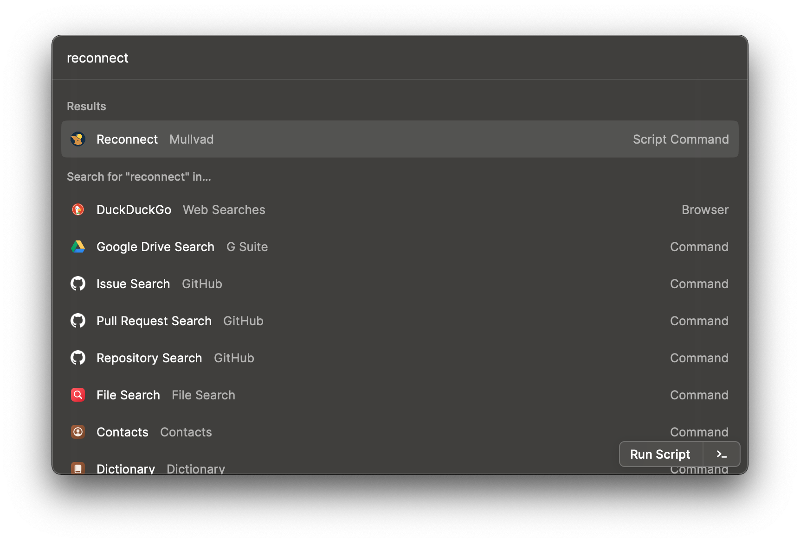

# Mullvad Package

A package of script commands to manage [Mullvad VPN](https://mullvad.net/) tunnel connections, wrapping the [Mullvad CLI](https://mullvad.net/en/help/cli-command-wg/).

## Dependencies

All commands in this package require the [Mullvad CLI](https://mullvad.net/en/help/cli-command-wg/). It is installed automatically when installing [the official desktop client](https://mullvad.net/download/). The _Search Countries, Cities, and Hostnames_ command also requires the [`fzf` utility](https://github.com/junegunn/fzf/). Install it via homebrew:

```sh
$ brew install fzf
```

Additional installation options are available in the tools' respective documentation.

## Command Usage

Because usage of the CLI is dependent on the the official desktop client app, all script commands are executed in the context of the user account currently logged in there.

### Connect


This command executes in `silent` mode, and connects to a Mullvad VPN tunnel using the most recently set configuration settings.

### Connect to Location


This command executes in `silent` mode, and connects to a Mullvad VPN tunnel satisfying the values of the passed `Country`, `City`, and `Hostname` arguments. Each argument expects their values in a specific format, but only `Country` is required. To retrieve the correct value(s) for your desired connection, use the [_Search Countries, Cities, and Hostnames_ command](#search-countries-cities-and-hostnames).

### Disconnect


This command executes in `silent` mode, and disconnects from the currently connected Mullvad VPN tunnel.

### Reconnect



This command executes in `silent` mode, and disconnects, then immediately connects again to the currently connected Mullvad VPN tunnel.

### Search Countries, Cities, and Hostnames


This command executes in `fullOutput` mode, searches the available countries, cities, and hostnames to which Mullvad VPN tunnel connections are possible, and prints all search results sorted by relevance in the following format:

```
COUNTRIES:
USA (us)
Austria (at)
Australia (au)
United Arab Emirates (ae)

CITIES:
Salt Lake City, UT (slc)
Brussels (bru)
Dusseldorf (dus)
Secaucus, NJ (uyk)
Sao Paulo (sao)
Budapest (bud)
Bucharest (buh)

HOSTNAMES:
us-mia-202 (193.27.12.2) - OpenVPN, hosted by M247
us-nyc-201 (89.46.62.15) - OpenVPN, hosted by M247
us-nyc-202 (89.46.62.28) - OpenVPN, hosted by M247
us-nyc-203 (89.46.62.41) - OpenVPN, hosted by M247
us-nyc-204 (89.46.62.54) - OpenVPN, hosted by M247
...
```
> The `Query` used to generate the above list is `us`, with the `Show Hostnames?` argument set to `y`. Results are truncated for brevity, and current as of March 20, 2021.

In the actual Raycast output, the values to be used with the [_Connect to Location_ command](#connect-to-location) are printed in
<span style="color: yellow;background-color: gray;font-family: monospace;padding: 2px;border-radius: 5px;">yellow</span>
. Because of the large number of possible search results, hostnames are omitted by default. They can be displayed by passing `y` as the value of the `Show Hostnames?` argument.

### Status


This dashboard command will show the current connection state of the Mullvad VPN tunnel. It automatically updates every five minutes.
