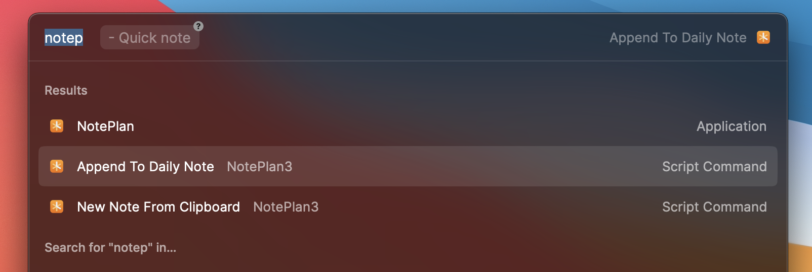

# NotePlan3

Script commands for [NotePlan3](https://noteplan.co)

## Commands

- **Open Daily Note**: Opens todays note in NotePlan3.

- **Append To Daily Note**: Appends input text to the Daily note of today. Really simple input that can include *, - or markdown for formatting. If input is left blank it will instead paste whatever text is in your clipboard.

- **New Note**: Create a new note with a title and optional content, can include *, - or markdown for formatting.

- **New Note From Clipboard**: Create a new note with a title and the contents of the clipboard (only works with text).

- **Search NotePlan**: Search NotePlan for a given string. Opens up the NotePlan search view.
