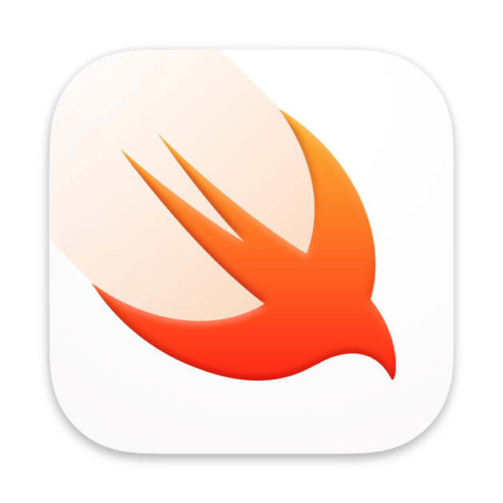
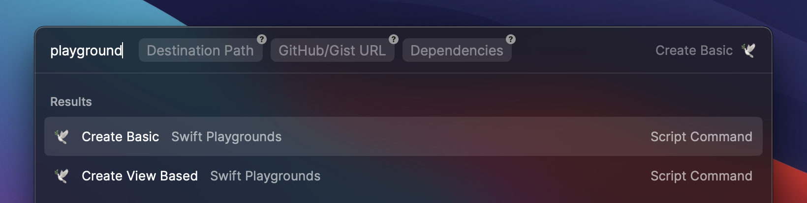

  
  <h2>Playground</h2>

Test and prototype using Swift Playground as easy as it should via [Raycast](http://raycast.com).

### Available scripts

- **Create Basic:** Create and open a new basic Swift Playground
- **Create View Based:** Create and open a new view based Swift Playground

### Arguments

#### Destination Path

Default is `/tmp/`

Example: `~/MyPlayground`

#### GitHub/Gist URL

Gist, a GitHub URL or any other URL to open in the created Playground.

Example: `https://gist.github.com/JohnSundell/b7f901e8edb89d1396ede4d8db3e8c21`

#### Dependencies

Add some dependencies to your playground.

Example: `~/unbox/unbox.xcodeproj,~/files/files.xcodeproj`
