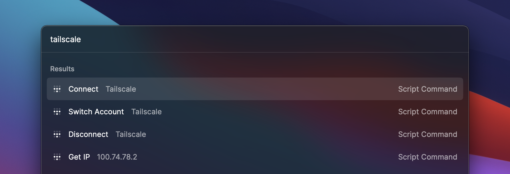

  
  <h2>Tailscale</h2>

Connect your macOS computer to your devices, services, and friends with these scripts that control the [Tailscale macOS application](https://tailscale.com/download) via [Raycast](http://raycast.com).

### Available scripts

- **Connect:** Connect to your most recent Tailscale network, logging in if needed.
- **Disconnect:** Disconnect from your Tailscale network.
- **Get IP:** shows your current [private Tailscale IP](https://tailscale.com/kb/1033/ip-and-dns-addresses/).
- **Switch Account:** Quickly switch between Tailscale networks.

> **Pro tip:** If [`jq` is installed](https://stedolan.github.io/jq/) in your $PATH, these scripts will show information about the network you're connecting to.
