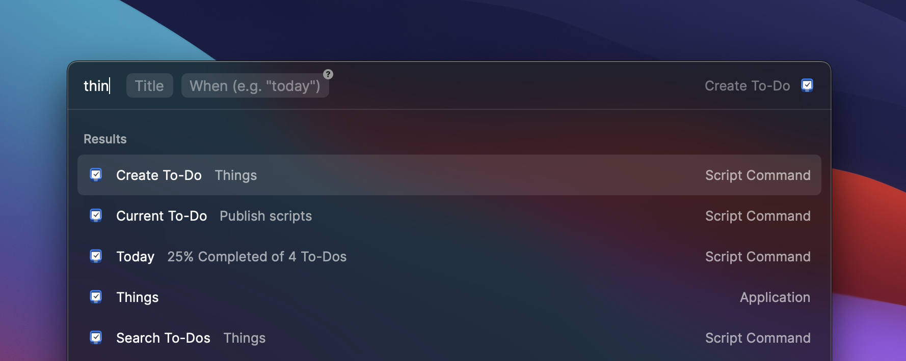

  
  <h2>Things</h2>

Stay on top of your to-dos with this collection of scripts that control the [Things macOS application](https://culturedcode.com/things/) via [Raycast](http://raycast.com). 

### Available scripts

- **Create To-Do:** Create a new To-Do and set an optional deadline.
- **Current To-Do:** Show your current To-Do in Raycast.
- **Search To-Dos:** Search To-Dos with a query.
- **Today:** Get an overview of your completed tasks.

> **Pro tip:** Add the *Current To-Do* or the *Today* script to your favorites to have it always visible when opening Raycast.
