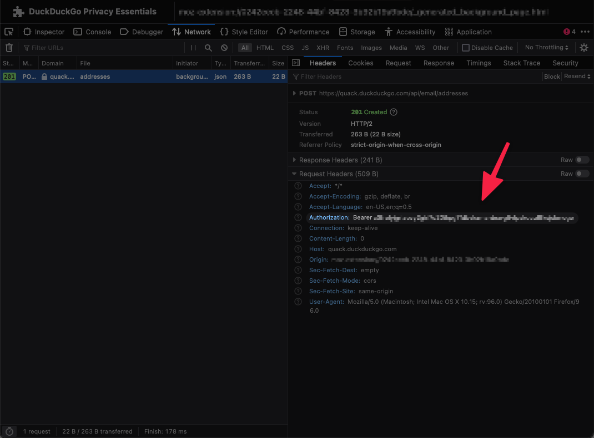

# What is DuckDuckGo Email Protection?
DuckDuckGo Email Protection is an email protection service (currently invite-only). After having been invited, DDG provides you with an intermediary e-mail address (you@duck.com). Any e-mail sent to this address will be stripped of its analytics components, before being forwarded to your actual e-mail address (you@you.com).

# About this Script Command
This script command lets you quickly generate a unique @duck.com address that is connected to your own e-mail address. Just like your personal you@duck.com address, the unique addresses will also forward any e-mail to your own e-mail address, after having been stripped of any tracking or analytics modules.

At the same time, DuckDuckGo allows you to create unique private e-mail addresses. These are randomly generated @duck.com addresses that also forward to your actual e-mail address. These are basically 'throw-away' e-mail addresses that you can use for any reason.

# Requirements
In order to configure this script command, you have to have been invited into the E-mail protection service beta. Currently, the only way to do this is through the DuckDuckGo app (iOS/Android). After you have been invited, you will need to extract your authorization ID from the DuckDuckGo desktop browser extension.

# Configuring DDG Email Protection Script command
Completing the following commands should allow you to generate new unique @duck.com addresses from Raycast. Note: this explanation assumes the use of FireFox. 

1. First, make sure you've set-up the DDG extension on Firefox (or Chrome)
2. Then, navigate go to about:debugging#/runtime/this-firefox
3. In the list of installed extension, look for DuckDuckGo Privacy Essentials and click 'Inspect'
4. In the inspector, navigate to the Network tab
5. Click on the extension icon, and click on 'Create new Duck Address' (bottom)
6. A new POST request will have appeared in the network tab, select it
7. In the 'Request Headers' section, look for 'Authorization'
8. Copy the string of randomized characters AFTER "Bearer "
9. Open Raycast and paste the string in the Configure script command. You will receive a confirmation should the string be correct.

# Cleanup
After configuring the script command, it is wise to disable the configuration command from Raycast settings.