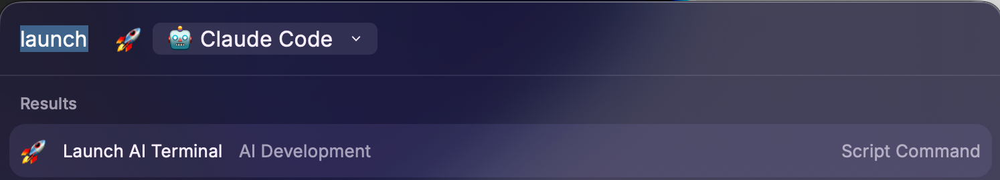
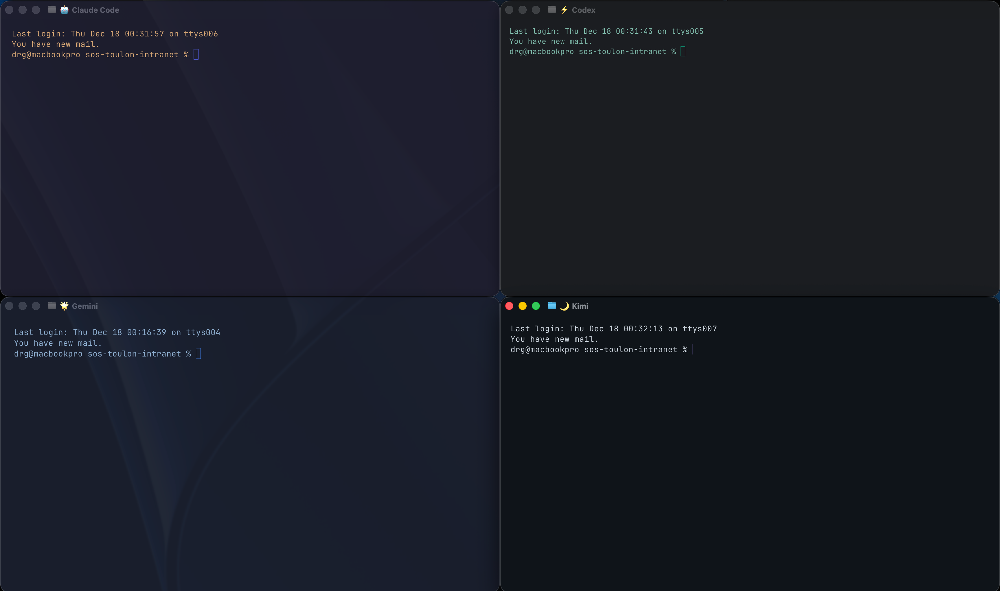

# Ghostty AI Terminal Launchers

Launch Ghostty terminal with distinct visual themes for different AI CLI tools. Instant visual identification prevents confusion when working with multiple AI terminals.

## Features

- **5 Visual Themes**: Claude Code, Codex, Gemini, Kimi, Standard
- **Dropdown Menu**: Quick selection via `Launch AI Terminal`
- **Direct Launch**: Individual scripts for hotkey assignment
- **Unique Cursors**: block, bar, underline, block_hollow styles
- **High Contrast**: WCAG AAA compliant colors
- **Fast Launch**: <1 second terminal spawn

## Preview




## AI Tools Supported

| Tool | Theme | Background | Cursor | Icon |
|------|-------|------------|--------|------|
| Claude Code | Warm gold | #1E1E2E | Block (violet) | 🤖 |
| Codex | Tech green | #1A1D21 | Bar (green) | ⚡ |
| Gemini | Sky blue | #1A1F2E | Underline (blue) | 🌟 |
| Kimi | Dark Side | #0F1419 | Hollow (violet) | 🌙 |
| Standard | Neutral | #282A36 | Block (violet) | 🖥️ |

## Installation

### Prerequisites

Install Ghostty terminal:
```bash
brew install ghostty
```

### Setup

1. Copy scripts to your Raycast scripts directory
2. Open Raycast → Extensions → Script Commands
3. Click "Reload Script Directories"
4. Search "Launch AI Terminal" or individual tool names

## Usage

### Dropdown Menu

1. Trigger Raycast (⌘+Space)
2. Type "Launch AI Terminal"
3. Select your AI tool from dropdown
4. Ghostty opens with themed terminal

### Direct Hotkeys (recommended)

Assign hotkeys in Raycast Preferences → Extensions → Script Commands:

```
⌥⌘A - Launch AI Terminal (dropdown)
⌥⌘C - Claude Code
⌥⌘X - Codex
⌥⌘G - Gemini
⌥⌘K - Kimi
⌥⌘T - Standard
```

## Customization

Edit script files to modify themes:

```bash
--background="#HEX"           # Background color
--foreground="#HEX"           # Text color
--cursor-style=[type]         # block|bar|underline|block_hollow
--cursor-color="#HEX"         # Cursor color
--background-opacity=[0-1]    # Transparency (0.96-1.0)
--background-blur-radius=[px] # Blur effect (0-4)
--window-padding-x=[px]       # Horizontal padding (12-24)
--window-padding-y=[px]       # Vertical padding (12-20)
```

### Example Customization

Create your own theme for a new AI tool:

```bash
#!/bin/bash
# @raycast.schemaVersion 1
# @raycast.title Your AI Tool
# @raycast.mode silent
# @raycast.packageName AI Development
# @raycast.icon 🔥
# @raycast.iconColor "#FF6B35"

open -na Ghostty.app --args \
    --title="🔥 Your AI" \
    --background="#1A1B26" \
    --foreground="#A9B1D6" \
    --cursor-style=bar \
    --cursor-color="#FF6B35" \
    --window-padding-x=18 \
    --window-padding-y=14 \
    > /dev/null 2>&1

exit 0
```

## Benefits

- **Eliminate Confusion**: Instantly identify which AI tool is running
- **Parallel Workflows**: Work with multiple AI tools simultaneously without mixing contexts
- **Muscle Memory**: Consistent hotkeys for each tool
- **Professional Look**: Polished visual distinctions for client demos or screencasts
- **Extensible**: Easy to add more AI tools following the same pattern

## Technical Details

- **Compatibility**: macOS 12+ (Bash 3.2+)
- **Dependencies**: Ghostty terminal
- **Performance**: <1s launch time, GPU-accelerated rendering
- **Validation**: ShellCheck passed with 0 warnings/errors
- **Standards**: WCAG AAA contrast ratios for accessibility

## Scripts Included

1. `launch-ai-terminal.sh` - Dropdown menu with 5 options
2. `launch-claude-code.sh` - Direct Claude Code launch
3. `launch-codex.sh` - Direct Codex launch
4. `launch-gemini.sh` - Direct Gemini launch
5. `launch-kimi.sh` - Direct Kimi launch
6. `launch-terminal-standard.sh` - Direct standard terminal
7. `list-recommended-themes.sh` - Theme reference documentation

## FAQ

### Why Ghostty instead of iTerm2/Alacritty?

Ghostty is GPU-accelerated, launches faster (<1s), and has simpler CLI arguments for theming. However, this pattern can be adapted to other terminals.

### Can I use this with other AI CLI tools?

Yes! Follow the customization example above. Popular tools that work well:
- Aider
- Cursor CLI
- Continue CLI
- GitHub Copilot CLI
- Amazon Q

### Does this work with multiple monitors?

Yes, Ghostty respects macOS window management. Each terminal can be placed on different displays.

### Can I change themes without editing scripts?

Currently themes are defined in scripts. For dynamic theme switching, consider using Ghostty's config file approach instead.

## Troubleshooting

### Ghostty not found
```bash
# Verify installation
which ghostty

# Install if missing
brew install ghostty
```

### Scripts don't appear in Raycast
1. Check file permissions: `chmod +x *.sh`
2. Reload: Raycast → "Reload Script Directories"
3. Verify metadata: Each script must have `@raycast.schemaVersion 1`

### Theme colors don't match
Ghostty may use your system's color profile. For consistent colors:
```bash
# Add to Ghostty config
color-profile = srgb
```

## Contributing

Found a bug or want to add a new AI tool theme? 
1. Test your changes locally
2. Validate with `shellcheck your-script.sh`
3. Submit PR with screenshots

## Author

Created by **rolldav** (David, drg) - Emergency physician & developer  
GitHub: [@rolldav](https://github.com/rolldav)

Inspired by the need to manage multiple AI coding assistants during complex development workflows.

## License

Same as Raycast Script Commands repository (MIT)


