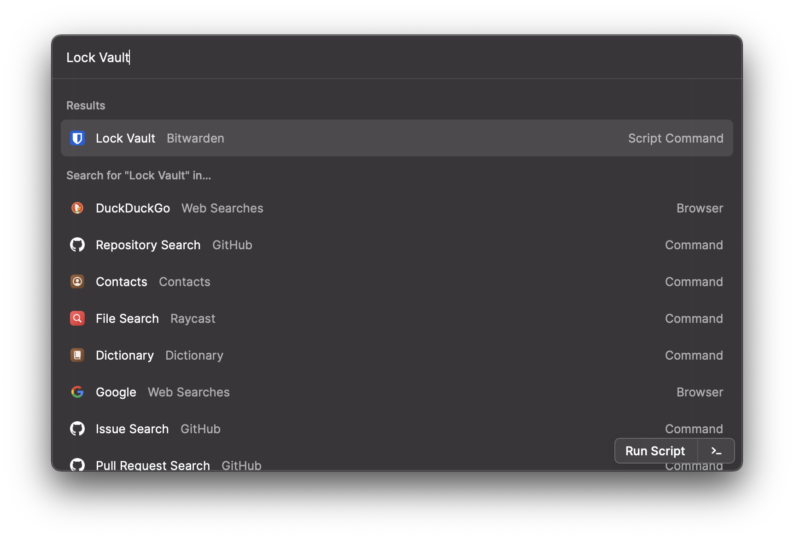
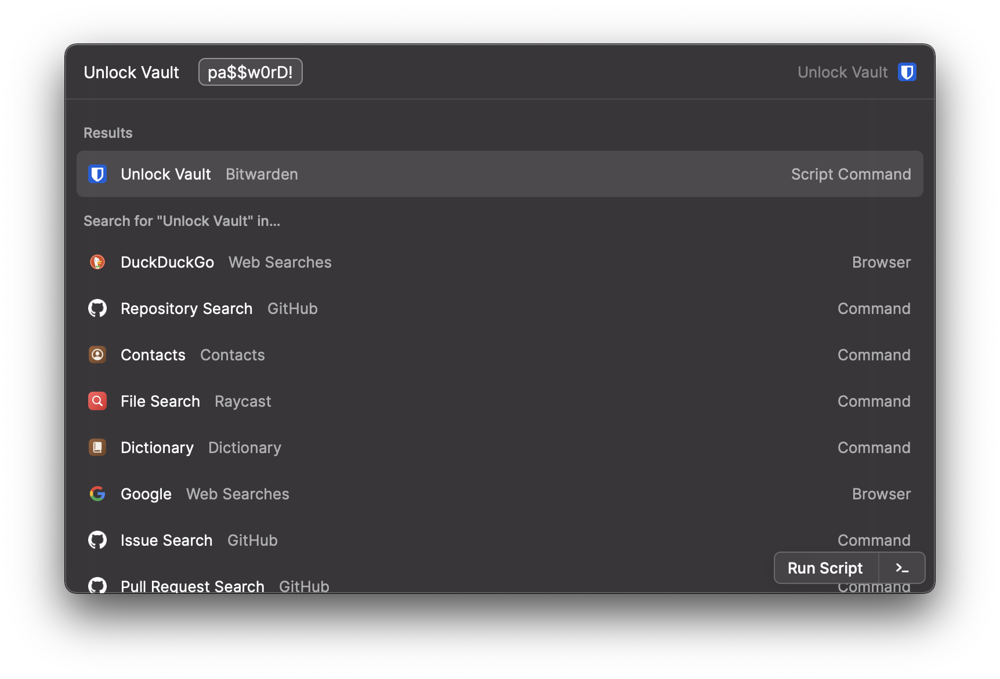
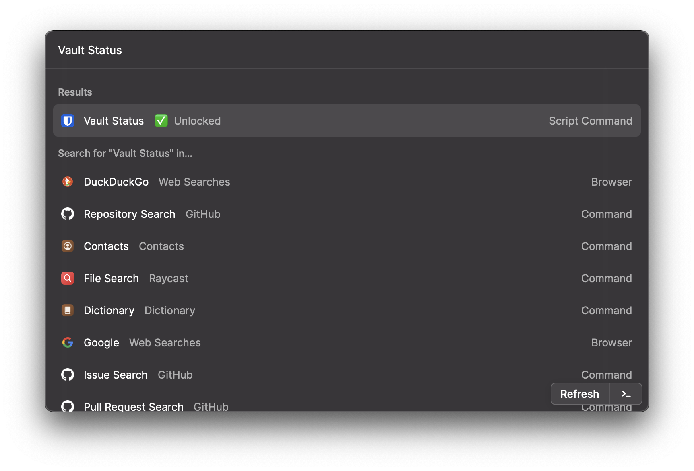

# Bitwarden Package

A package of script commands to interact with a [Bitwarden](https://bitwarden.com/) vault, wrapping the [Bitwarden CLI](https://bitwarden.com/help/article/cli/).

## Dependencies

All commands in this package require the [Bitwarden CLI](https://bitwarden.com/help/article/cli/). The _Vault Status_, _Search Vault Items_, and _Copy First Matching Password_ commands also require the [`jq` utility](https://stedolan.github.io/jq/). Install both via homebrew:

```sh
$ brew install bitwarden-cli jq
```

Additional installation options are available in the tools' respective documentation.

## Command Usage

### Log In


This is the only template command in the package. **If you use multifactor authentication to log in to Bitwarden, be sure to set the value of the `MFA_METHOD` variable.** The [values available to use](https://bitwarden.com/help/article/cli/#enums) are:

| MFA Method        | Value |
|-------------------|:-----:|
| Authenticator App | 0     |
| Email             | 1     |
| Yubikey           | 3     |

If you _do not_ use multifactor authentication to access your Bitwarden vault, leave this variable set to `""`, and optionally remove the MFA Code argument (or leave it blank when logging in). Enabling multifactor authentication is encouraged.

### Log Out


This command executes in `silent` mode, and deauthenticates the authenticated Bitwarden vault.

### Lock Vault



This command executes in `silent` mode, and locks the authenticated Bitwarden vault without deauthenticating.

### Unlock Vault



This command executes in `silent` mode, and unlocks the authenticated Bitwarden vault.

### Vault Status



This dashboard command will show the current authentication and/or lock state of the Bitwarden vault. It automatically updates every five minutes. The possible states are `unauthenticated`, `locked`, and `unlocked`.

### Search Vault Items


This command executes in `fullOutput` mode, searches **items** in the unlocked Bitwarden vault, and prints all search results in the following format:

```json
{
  "name": "Service Name",
  "username": "username",
  "password": "password", # optional
  "uris": [
    "https://www.example.com",
    "https://www.another-example.com"
  ],
  "lastUpdated": "2020-11-29T20:39:56.509Z",
  "notes": "Notes appear here",
  "fields": [
    {
      "name": "Custom Field Name 1",
      "value": "Custom Field Value 1",
      "type": 1
    },
    {
      "name": "Custom Field Name 2",
      "value": "Custom Field Value 2",
      "type": 0
    }
  ]
}
```

Passwords are omitted by default. Pass `y` as the value of the `Include Passwords?` argument to include them. You can modify the above format using the `output_format` variable.

### Copy First Matching Password


This command executes in `silent` mode, searches the unlocked Bitwarden vault, and copies the password associated with the first search result to the clipboard.

## About Authentication

Vaults are separately authenticated and locked. All unlocked vaults are authenticated, but not all authenticated vaults are unlocked. The included _Log In_ command will both authenticate **and** unlock the authenticated vault, but you do not need to log out in order to secure your vault. Simply using the _Lock_ command will do so, and you can then use _Unlock_ later before searching again.

The package commands utilize the macOS keychain to store and maintain session tokens. Tokens are stored under the user's account and the `raycast-bitwarden` service. When the vault is both authenticated and unlocked, you can retrieve your session token via the command line with:

```sh
$ security find-generic-password -a ${USER} -s raycast-bitwarden
```

> Manipulating your session token directly, via either the command line or the Keychain Access UI is discouraged. See below for troubleshooting if you choose to do so anyway.

### Troubleshooting

If you use the Bitwarden CLI and/or `security` command in your command line, or the Keychain Access UI to manipulate your session token (and therefore your vault's lock or authentication status), you may encounter errors using this package. In the event that the _Vault Status_ command does not align with the CLI status' output, try running the _Log Out_ command, or:

```sh
$ bw logout && security delete-generic-password -a ${USER} -s raycast-bitwarden
```
Then, log in and unlock again using the _Log In_ script.

> For more information on session management, see the [Bitwarden CLI documentation](https://bitwarden.com/help/article/cli/#session-management).
