# Bitwarden Package

A package of script commands to interact with [Bitwarden Vaults](https://bitwarden.com/) and [Bitwarden Sends](https://bitwarden.com/products/send/), wrapping the [Bitwarden CLI](https://bitwarden.com/help/article/cli/).

- [Dependencies](#dependencies)
- [Authentication Command Usage](#authentication-command-usage)
  * [Log In](#log-in)
  * [Log In with API Key](#log-in-with-api-key)
  * [Log Out](#log-out)
  * [Lock Session](#lock-session)
  * [Unlock Session](#unlock-session)
  * [Bitwarden Status](#bitwarden-status)
- [Bitwarden Vault Command Usage](#bitwarden-vault-command-usage)
  * [Search Vault Items](#search-vault-items)
  * [Copy First Matching Password](#copy-first-matching-password)
  * [Copy First Matching TOTP](#copy-first-matching-totp)
- [Bitwarden Send Command Usage](#bitwarden-send-command-usage)
  * [Create a Text Send](#create-a-text-send)
  * [Receive a Text Send](#receive-a-text-send)
  * [List All Text Sends](#list-all-text-sends)
  * [Edit a Send](#edit-a-send)
  * [Delete a Send](#delete-a-send)
- [Appx: About Authentication](#appx--about-authentication)
  * [Session Tokens](#session-tokens)
    + [Session Token Manipulation](#session-token-manipulation)
  * [Troubleshooting](#troubleshooting)

## Dependencies

All authentication and vault-related commands in this package require the [Bitwarden CLI](https://bitwarden.com/help/article/cli/) v1.14.0 or later. Bitwarden Send-related commands require v1.15.1 or later. The _Bitwarden Status_, _Search Vault Items_, _Copy First Matching Password_, _Copy First Matching TOTP_, and Bitwarden Send-related commands (except _Delete a Send_) also require the [`jq` utility](https://stedolan.github.io/jq/).

Install the latest version of both dependencies via homebrew:

```sh
$ brew install bitwarden-cli jq
```

Additional installation options are available in the tools' respective documentation.

## Authentication Command Usage

### Log In

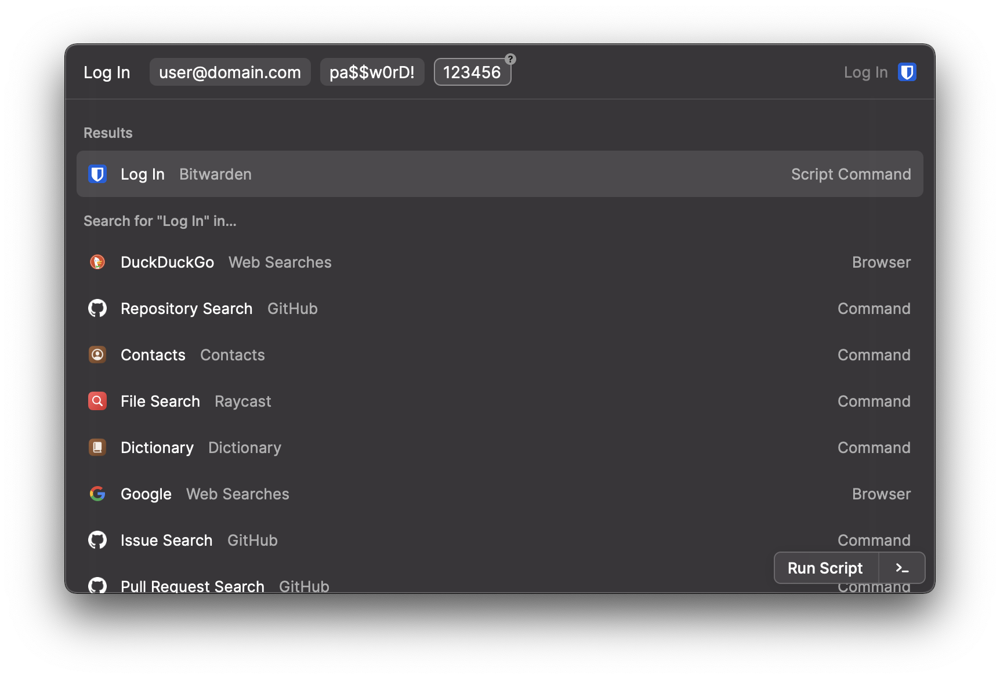

This command executes in `silent` mode, and both authenticates and unlocks a Bitwarden account session.

**If you use multifactor authentication to log in to your Bitwarden account, be sure to set the value of the `MFA_METHOD` variable.** The [values available to use](https://bitwarden.com/help/article/cli/#enums) are:

| MFA Method        | Value |
|-------------------|:-----:|
| Authenticator App | 0     |
| Email             | 1     |
| Yubikey           | 3     |

If you _do not_ use multifactor authentication to log in to your Bitwarden account, leave this variable set to `""`, and optionally remove the MFA Code argument (or leave it blank when logging in). Enabling multifactor authentication is encouraged.

### Log In with API Key

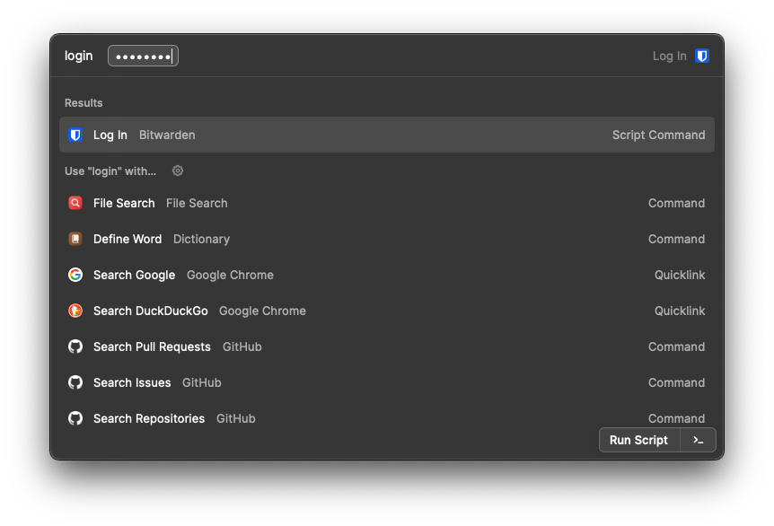

This command executes in `silent` mode, and both authenticates and unlocks a Bitwarden account session using an alternative authentication method required when Bitwarden thinks the authentication comes from bot traffic. See the [Bitwarden CLI documentation](https://bitwarden.com/help/article/cli-auth-challenges/) for more information. Be sure to set the values of the `BW_CLIENTID` and `BW_CLIENTSECRET` variables. These credentials can be found in the account settings of [the web vault](https://vault.bitwarden.com/#/settings/account) (in the "API Key" section).

### Log Out

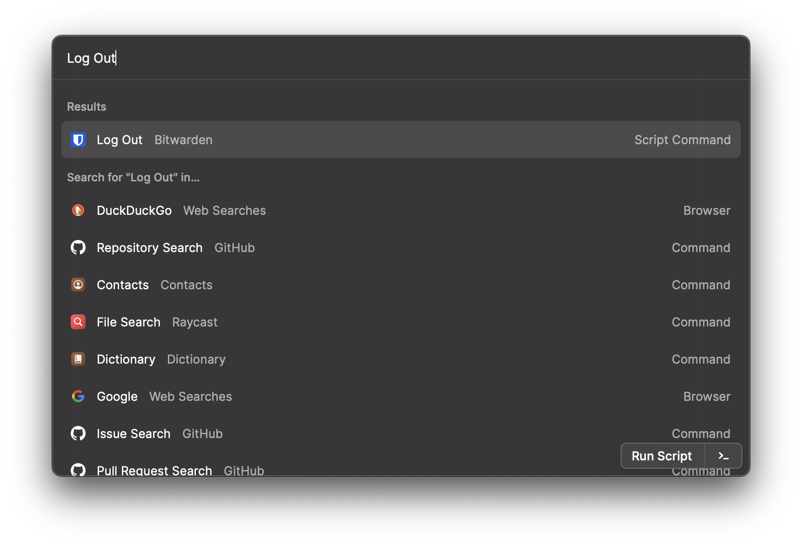

This command executes in `silent` mode, and deauthenticates the authenticated Bitwarden session.

### Lock Session

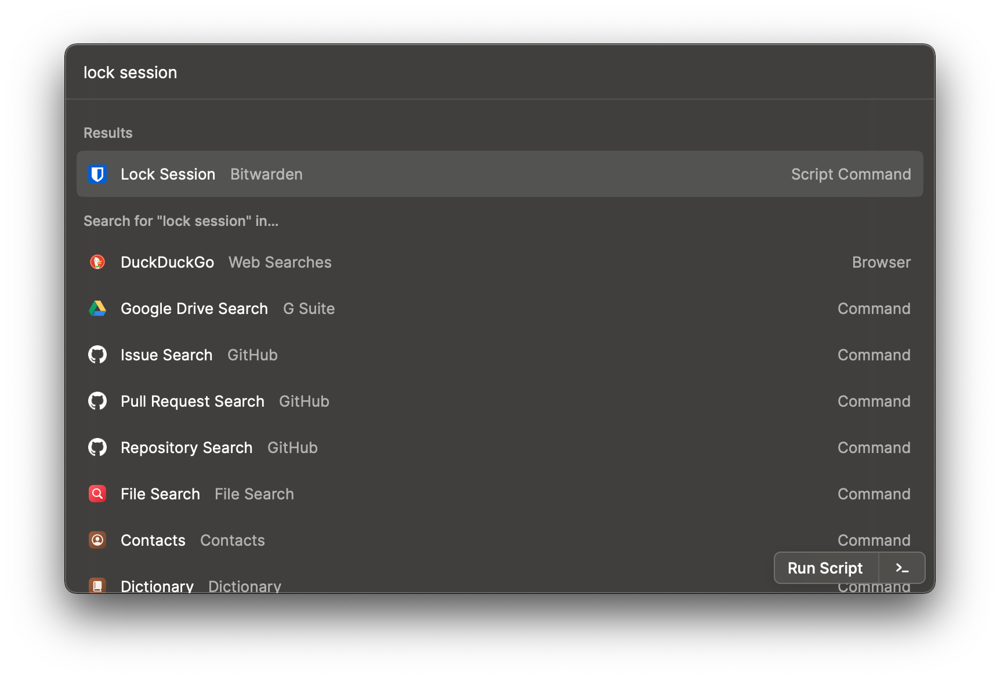

This command executes in `silent` mode, and locks the authenticated Bitwarden session without deauthenticating.

### Unlock Session

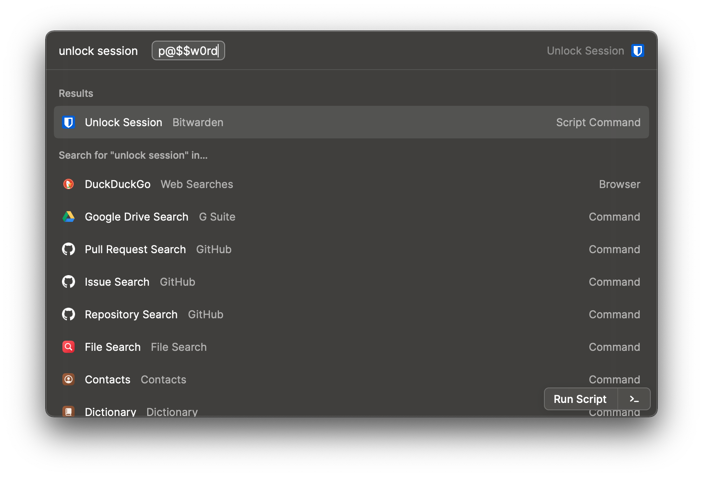

This command executes in `silent` mode, and unlocks the authenticated Bitwarden session.

### Bitwarden Status

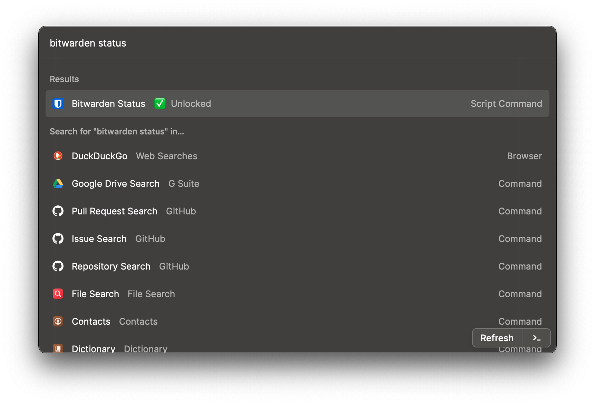

This dashboard command will show the current authentication and/or lock state of the Bitwarden session. It automatically updates every five minutes. The possible states are "Unauthenticated", "Locked", and "Unlocked".

## Bitwarden Vault Command Usage

### Search Vault Items

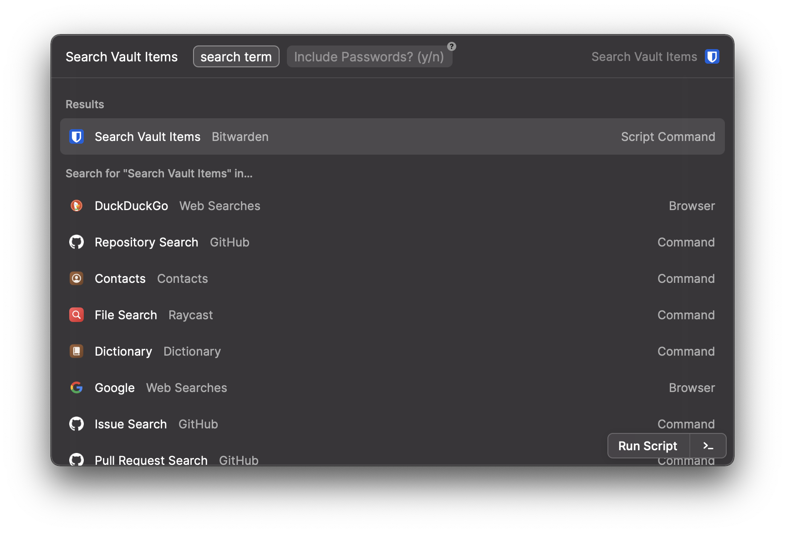

This command executes in `fullOutput` mode, searches **items** in the unlocked Bitwarden vault, and prints all search results in the following format:

```json
{
  "name": "Service Name",
  "username": "username",
  // optional password
  "password": "password",
  "uris": [
    "https://www.example.com",
    "https://www.another-example.com"
  ],
  "lastUpdated": "2020-11-29T20:39:56.509Z",
  "notes": "Notes appear here",
  "fields": [
    {
      "name": "Custom Field Name 1",
      "value": "Custom Field Value 1",
      "type": 0
    },
    // Optional hidden field
    {
      "name": "Custom Field Name 2",
      "value": "Custom Field Value 2",
      "type": 1
    }
  ]
}
```
> The `"type"` property of `fields` objects are not included in the actual output. They are displayed here to illustrate that the first field is not a hidden field, but the second field is.

Passwords and hidden fields are omitted by default. Pass `y` as the value of the `Include Passwords?` argument to include them. You can modify the above format using the `output_format` variable.

### Copy First Matching Password

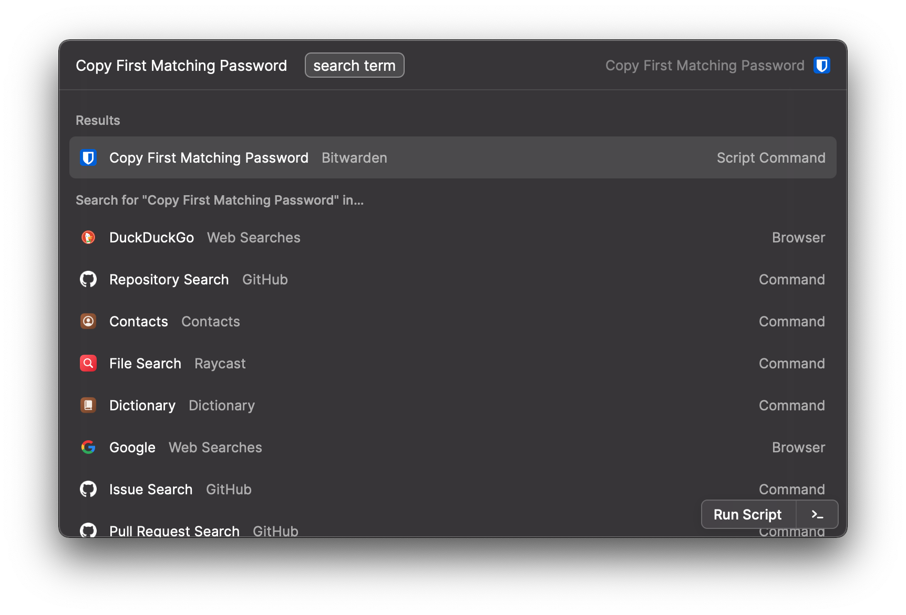

This command executes in `silent` mode, searches the unlocked Bitwarden vault, and copies the password associated with the first search result to the clipboard.

### Copy First Matching TOTP

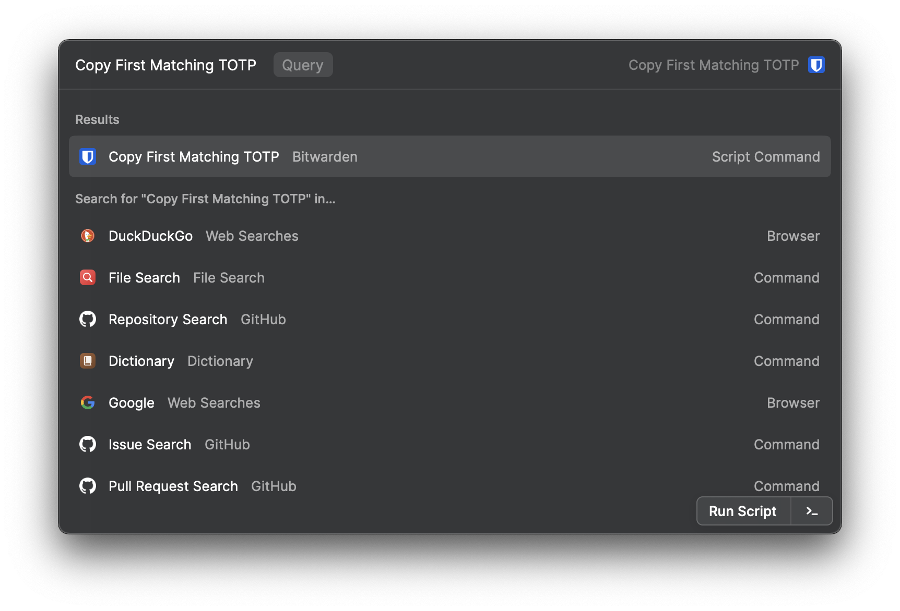

This command executes in `silent` mode, searches the unlocked Bitwarden vault, and copies the TOTP associated with the first search result to the clipboard.

## Bitwarden Send Command Usage

### Create a Text Send

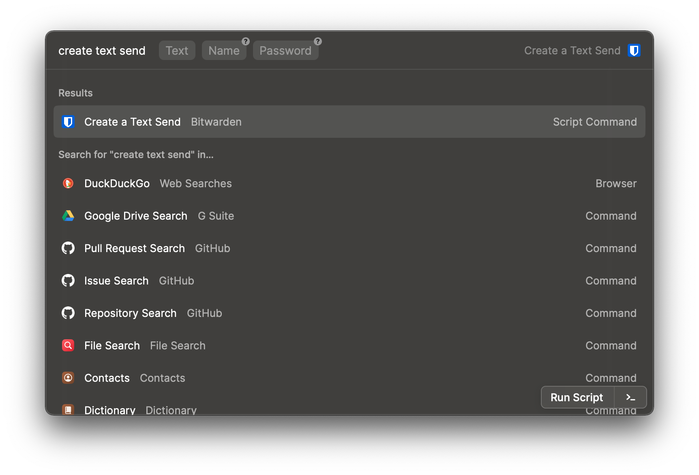

This command executes in `silent` mode, creates a new hidden text Send with the provided details, and copies the Send's URL to the clipboard. The Send's deletion date is automatically set to the default value of 7 days from the creation date.

### Receive a Text Send

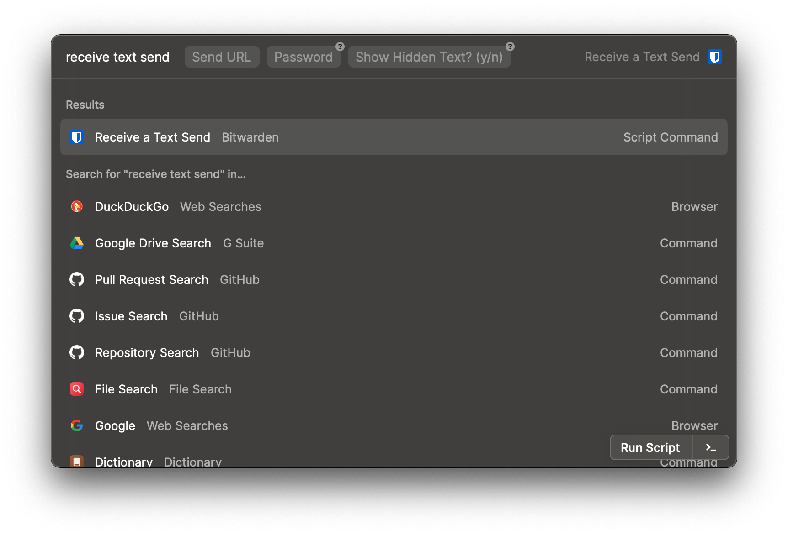

This command executes in `fullOutput` mode and displays the title and text content of the specified text Send. If the Send is password protected, provide the password as the value of the "Password" argument. If the Send's text is hidden by default, pass "y" as the value of the "Show Hidden Text?" argument to display it.

> **Note:** Because of the behavior of the [`bw send receive`](https://bitwarden.com/help/article/send-cli/#receive) command, there is no way for this script command to exit with an error when attempting to receive a password-protected Send without providing a password.

### List All Text Sends

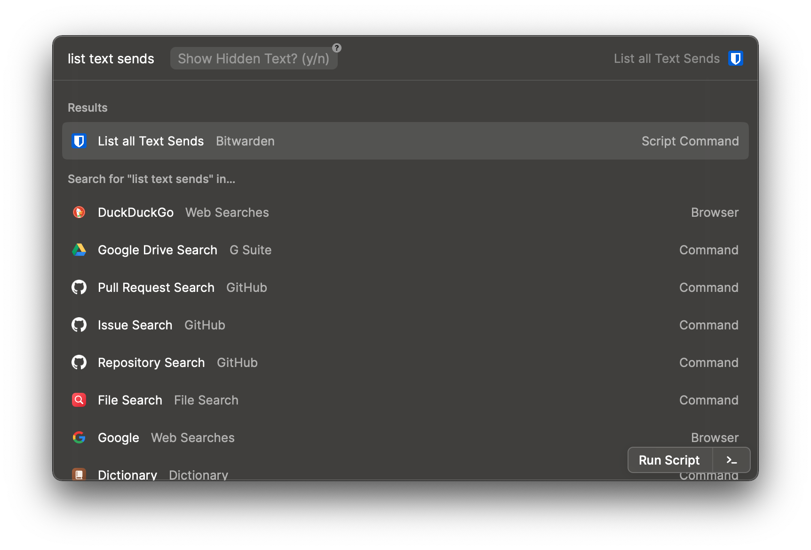

This command executes in `fullOutput` mode and displays all text sends created in the currently unlocked Bitwarden account. Pass "y" as the value of the "Show Hidden Text?" argument to display the text content of any hidden Sends.

### Edit a Send

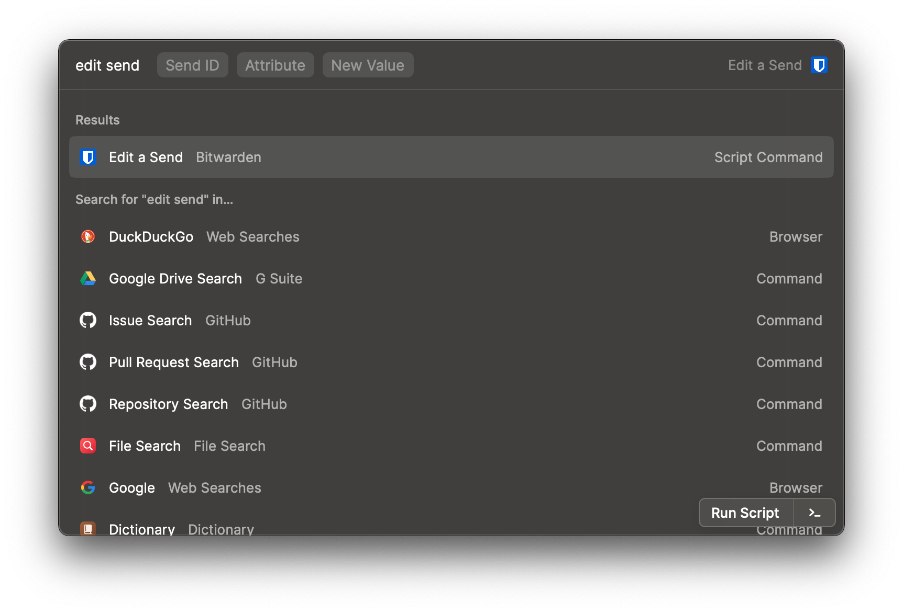

This command executes in `fullOutput` mode and displays the updated Send after making the desired modifications. To determine the correct ID of the Send to update, use the _List All Text Sends_ command. The possible "Attribute"s that can be updated are:

| Value in _List All Text Sends_ Output | Value to Pass as "Attribute" to Update | Notes                                                                                                                                                                                                                                                 |
|---------------------------------------|----------------------------------------|-------------------------------------------------------------------------------------------------------------------------------------------------------------------------------------------------------------------------------------------------------|
| `name`                                | name                                   |                                                                                                                                                                                                                                                       |
| `id`                                  |                                        | Although the [`bw send edit` command](https://bitwarden.com/help/article/send-cli/#edit) documentation states that it's possible to edit a Send's ID, a bug in v1.15.1 prevents this from being possible.                                             |
| `text`                                | text                                   |                                                                                                                                                                                                                                                       |
| `deletionDate`                        | deletionDate                           | Use ISO-8601 date format.                                                                                                                                                                                                                             |
| `expirationDate`                      | expirationDate                         | Use ISO-8601 date format.                                                                                                                                                                                                                             |
| `maxAccessCount`                      | maxAccessCount                         |                                                                                                                                                                                                                                                       |
| `accessCount`                         | accessCount                            |                                                                                                                                                                                                                                                       |
| `passwordSet`                         |                                        | It is not currently possible to remove a password from a Send using the `bw` CLI.                                                                                                                                                                     |
| `notes`                               | notes                                  |                                                                                                                                                                                                                                                       |
| `url`                                 | url                                    |                                                                                                                                                                                                                                                       |
|                                       | password                               | A Send's password is never displayed in the JSON response from the CLI. You can still update a Send's password using this script command. Note that attempting to update a password to `""` (to effectively remove the password) will throw an error. |
|                                       | disabled                               | (Boolean) Controls whether the Send can be received by others.                                                                                                                                                                                        |
|                                       | hidden                                 | (Boolean) Controls whether the Send's text is hidden by default.                                                                                                                                                                                      |

> Values not present in the _Value to Pass as "Attribute" to Update_ column cannot be modified.

### Delete a Send

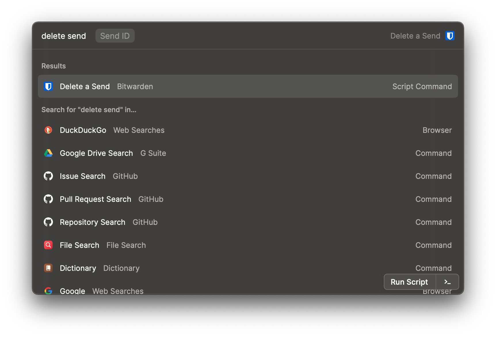

This command executes in `silent` mode and deletes the Send with the passed ID value. To retrieve the ID value of a Send to delete, use the _List All Text Sends_ command.

## Appx: About Authentication

Bitwarden sessions are separately authenticated and locked. All unlocked sessions are authenticated, but not all authenticated sessions are unlocked. The included _Log In_ command will both authenticate **and** unlock the authenticated session, but you do not need to log out in order to secure your session. Simply using the _Lock_ command will do so, and you can then use _Unlock_ later before using commands again.

> For more information on session management, see the [Bitwarden CLI documentation](https://bitwarden.com/help/article/cli/#session-management).

### Session Tokens

The Bitwarden CLI uses a session token system to maintain the lock/unlock state of an authenticated session, and this package utilizes the macOS keychain to store and maintain these session tokens. Running the _Lock_ and _Log Out_ commands in this package will invalidate any existing session tokens and remove them from the keychain. Conversely, running the _Log In_ and _Unlock_ commands will create a new session token and store it in the keychain accordingly, while both invalidating and overwriting any existing session token that may exist.

#### Session Token Manipulation

> Manipulating your session token directly, via either the command line or the Keychain Access UI is discouraged. See below for troubleshooting if you choose to do so anyway.

Tokens are stored in the macOS keychain under the user's account and the `raycast-bitwarden` service. When the session is both authenticated and unlocked, you can retrieve your session token via the command line with:

```sh
$ security find-generic-password -a ${USER} -s raycast-bitwarden
```

You can manually remove your session token with:

```sh
$ security delete-generic-password -a ${USER} -s raycast-bitwarden
```

> **IMPORTANT:**<br/>
>Removing your session token using this method will only prevent this package from executing script commands. The Bitwarden session itself will remain unlocked, and accessible via the Bitwarden CLI by including the `--session {{token}}` argument when executing CLI commands.

New session tokens can only be created using the Bitwarden CLI. Creating a new session token will invalidate any tokens created previously. To create a new session token, use [the `bw login` command](https://bitwarden.com/help/article/cli/#logging-in) if not already authenticated, otherwise use [the `bw unlock` command](https://bitwarden.com/help/article/cli/#locking). To restore usage of this package after creating a new session token, run:

```sh
security add-generic-password -U -a ${USER} -s raycast-bitwarden -w {{token}}
```

### Troubleshooting

If you use the Bitwarden CLI and/or `security` command in your command line, or the Keychain Access UI to manipulate your session token (and therefore your session's lock status, from the perspective of this package), you may encounter errors using the package's script commands. In the event that the _Session Status_ command does not align with the CLI status' output, try running the _Log Out_ command, or:

```sh
$ bw logout && security delete-generic-password -a ${USER} -s raycast-bitwarden
```

This will invalidate any existing session tokens and remove them from your keychain. You may then create a new session token, and store it accordingly, using the _Log In_ command.
