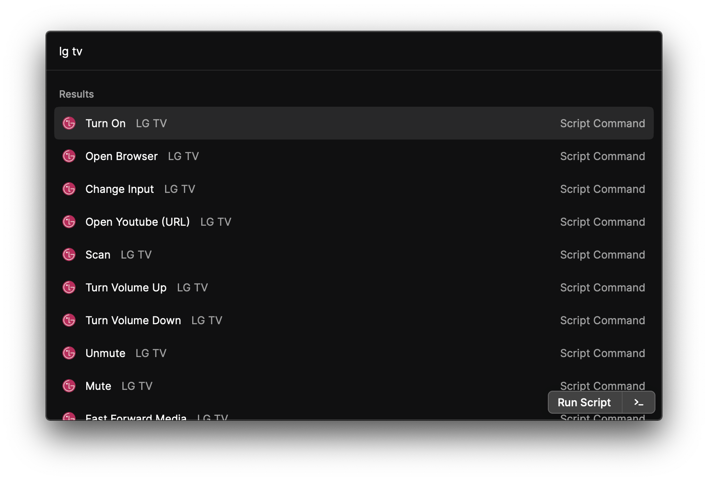

## LG TV (powered by [LGWebOSRemote](https://github.com/klattimer/LGWebOSRemote))



Manage your LG TV with the collection of scripts that execute the [LGWebOSRemote commands](https://github.com/klattimer/LGWebOSRemote) via [Raycast](http://raycast.com).

### Initial setup

0. (Optional) Assign a static IP address to the TV.

   > This step is optional, but highly recommended to avoid re-authentication when the IP changes. The instruction depends on the router model, but the phrase you are looking for is `DHCP`:
   >
   > - Asus: https://www.asus.com/support/FAQ/114068/
   > - TP-Link: https://www.tp-link.com/us/support/faq/560/
   > - etc.

1. Install the `LGWebOSRemote` library system-wide.

   > The recommended way is to use **[pipx](https://github.com/pypa/pipx)**:
   >
   > `pipx install git+https://github.com/klattimer/LGWebOSRemote`

2. Run the `Scan` command.

   > Remember the TV has to be turned on.

3. Copy the TV IP address from the output.

   ```python
   {"result": "ok", "count": 1, "list": [{"uuid": "some-long-id", "model": "OLED55C11LB", "address": "192.168.1.200"}]}
   ```

4. Run the `Authenticate` command with the obtained IP.

   > Remember the TV has to be turned on and you have to accept the connection on the TV.

5. Voilà, now you can control the TV!

### Available scripts

All the scripts with their descriptions can be found [here](https://github.com/raycast/script-commands/tree/master/commands#lg-tv).

### Known issues

- Commands' outputs are quite messy, e.g. always include `DEBUG` messages (bug in the library).
- Only one TV configuration at a time is supported (bug in the library).
- `Execute Command` command doesn't work (bug in the library).
- `Send Notification With Icon` command doesn't work (bug in the library).
- `Open Youtube (URL)` and `Open Youtube (ID)` commands don't seem to work (but try them yourself).
- `Show Config` command runs forever - you have to cancel the process with `Control+C` (bug in the library).
- Commands are not documented, so some of them are not obvious to use, e.g. `Open App With Payload`.

**If you find out any more issues related to the library, not the Raycast scripts, please report them in [the LGWebOSRemote repository](https://github.com/klattimer/LGWebOSRemote) or... just contribute to the library by fixing them 🙂**
