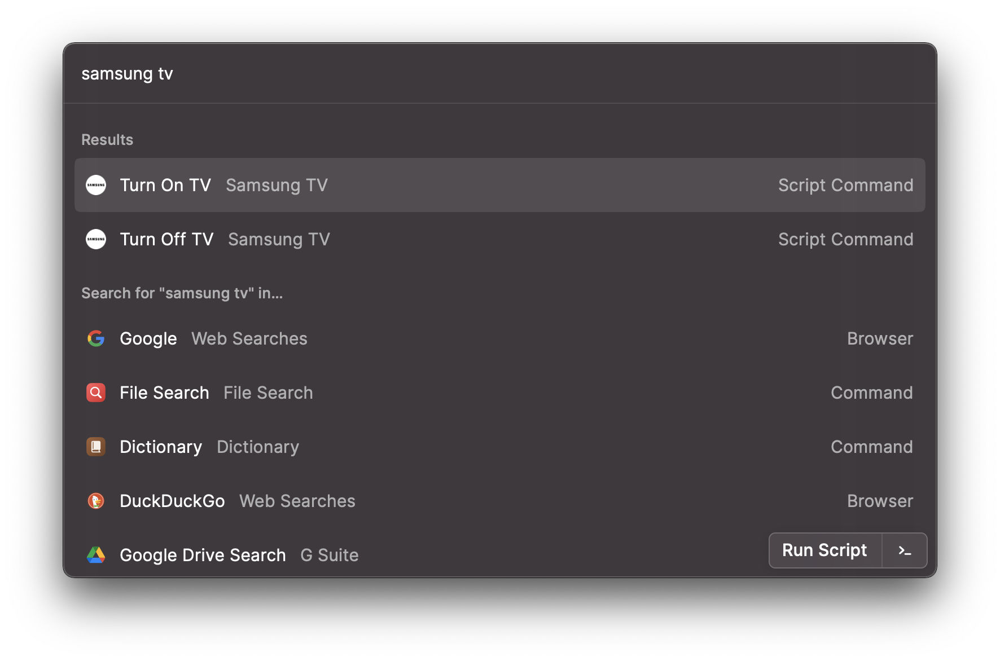

## Samsung TV

Manage your Samsung TV via [Raycast](http://raycast.com).

### Compatibility
> [Here](https://developer.samsung.com/smarttv/develop/specifications/tv-model-groups.html) are a complete list of compatible Samsung models that will be able to use these commands

### Initial setup

1. Install the `wakeonlan` module

   
   > `pip3 install wakeonlan`

2. Obtain your preferred Samsung TV's IP and MAC Address then update the `turn-on.template.py` and `turn-off.template.py`

   > Remember to remove the **.template.** from the scripts after updating

3. Reload your scripts and Voilà ! Now you can control the TV via Raycast!

### Important
- First time users will need to allow the device to connect to it
- Some TVs will need the user to allow IP remote devices to connect to it

### Known issues

- After turning the TV off. Users cannot turn the TV back via `Turn on TV` command until ~10-15 secs later 

