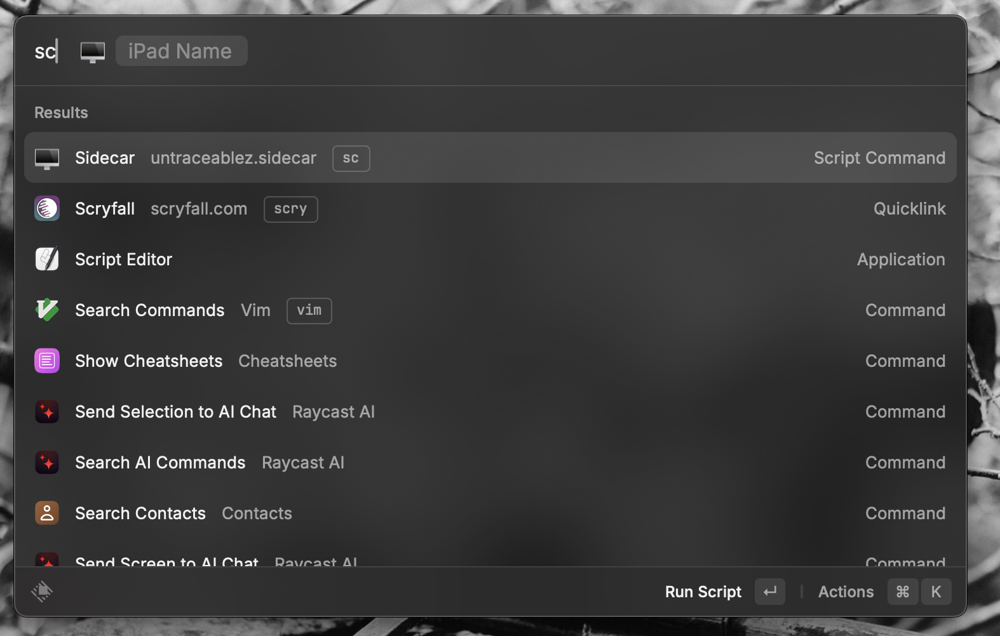

## Sidecar

  

Connect your iPad via Sidecar using [Raycast](http://raycast.com).

### Important
- You **must** pass through the name of your iPad. 
- This script works with wired OR wireless connections. 
- **Your iPad must be on the same network. Using a VPN on your iPad will make the connection break, *even* when in wired mode. This is an issue with Sidecar, not the script.**

### Known issues

- Ocassional issues with System Settings not opening quickly enough, resulting in script failure. To resolve, simply run the command again. 

