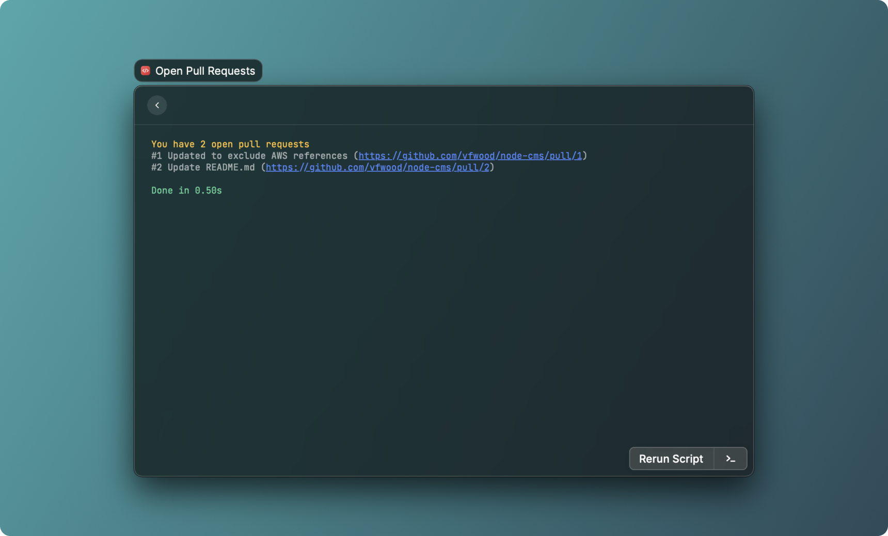
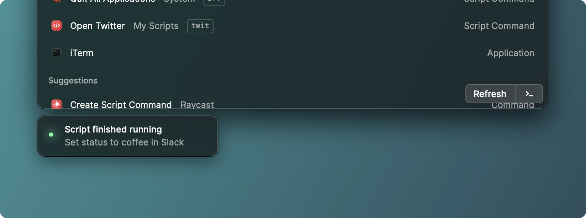
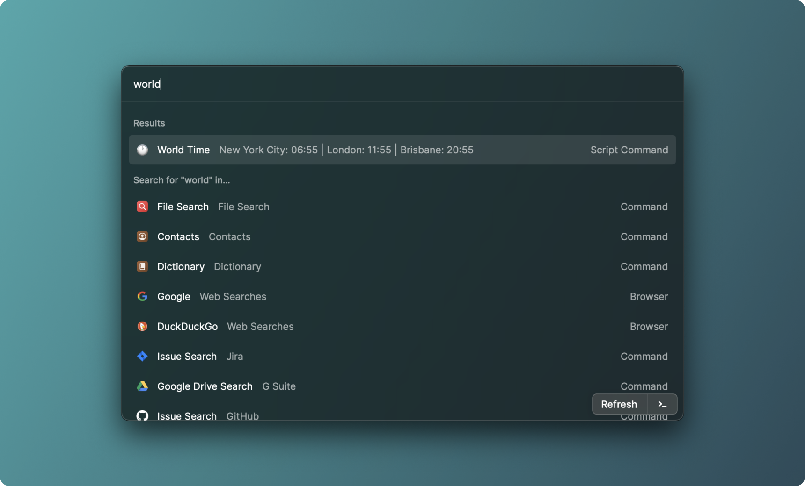
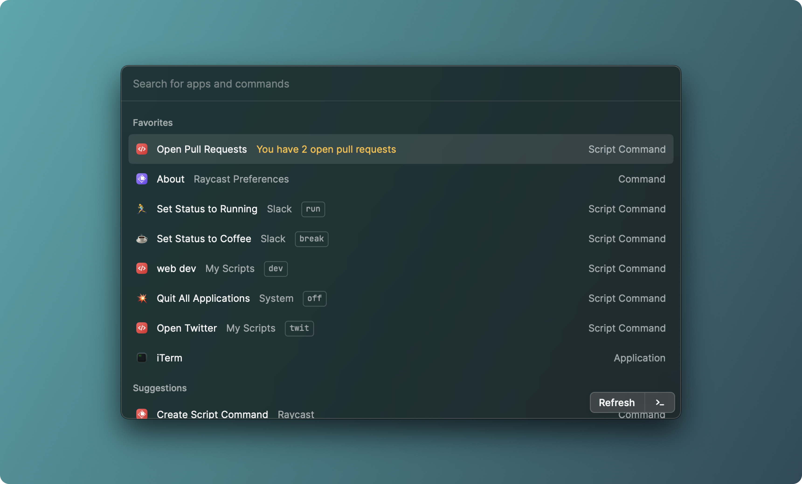

In `fullOutput` the entire output is presented on a separate view, similar to a terminal window. This is handy when your script generates output to consume.

In `compact` mode the last line of the standard output is shown in the toast

In `silent` mode the last line (if exists) will be shown in overlaying HUD toast after Raycast window is closed.

In `inline` mode, the first line of output will be directly shown in the command item and automatically refresh according to the specified `refreshTime`. Tip: Set your dashboard items as favourites via the action menu in Raycast

🚨 Hint: use `cmd k` to access extra functionality such as adding to favourites or reordering the root search preferences.

# ANSII Supported Colours 🎨

We support colours for `inline` and `fullOutput` mode scripts for you to customise generated output by changing its background and foreground colour.

Escape code is in linux format: `0x1B`

Colours are adapted to current users apperance settings (light and dark themes)

**Other supported codes:**

[Untitled](https://www.notion.so/550b81f90f9c48e385feba68a363abb6)

Unsupported terminal codes will be stripped out from output and ignored.

**Example:**

[Untitled](https://www.notion.so/40a837370fbc4eb68d41efbf9061de20)